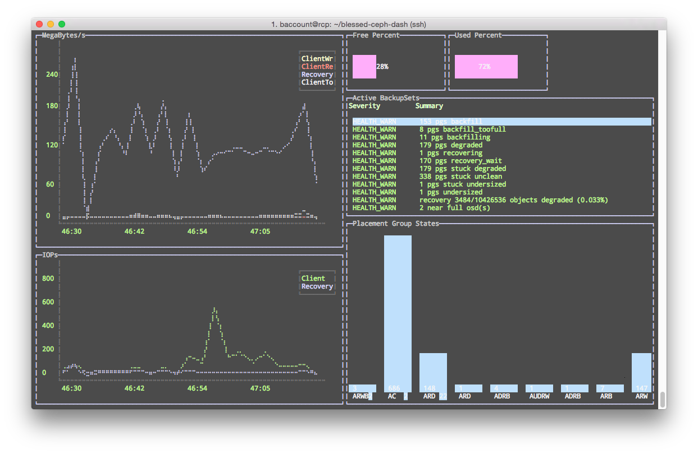

# blessed-ceph-dash
ceph dashboard using blessed-contrib

**Please note as of this time the dashboard only works with my `lcd-display` branch of [blessed-contrib](https://github.com/xcezzz/blessed-contrib/tree/lcd-display)**

```bash
npm install https://github.com/xcezzz/blessed-contrib.git\#lcd-display
```



The dashboard uses an express route so that you can post the output of `ceph status -f json` to it.

Adding more features and customizability soon.

Since my Ceph cluster is on a private network and inaccessible from dev machines. The Ceph cluster POSTs data outbound to port 3004 (default port used in this).

####On some host
```bash
git clone https://github.com/xcezzz/blessed-ceph-dash.git

node index
```

###On a machine that can access the Ceph cluster
```bash
while true; do 
    ceph status -f json | curl -X POST \
    	-H "Content-type: application/json" \
    	-d @- http://remotehost:3004/; 
    sleep 2; 
done
```
